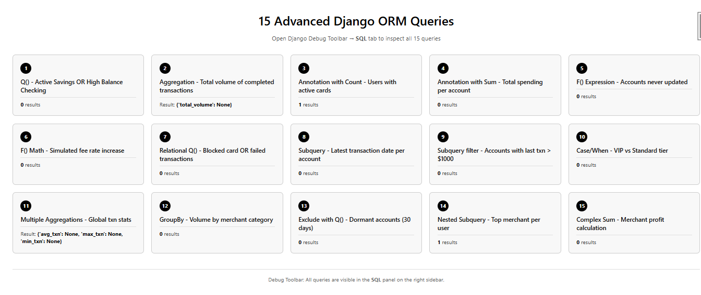
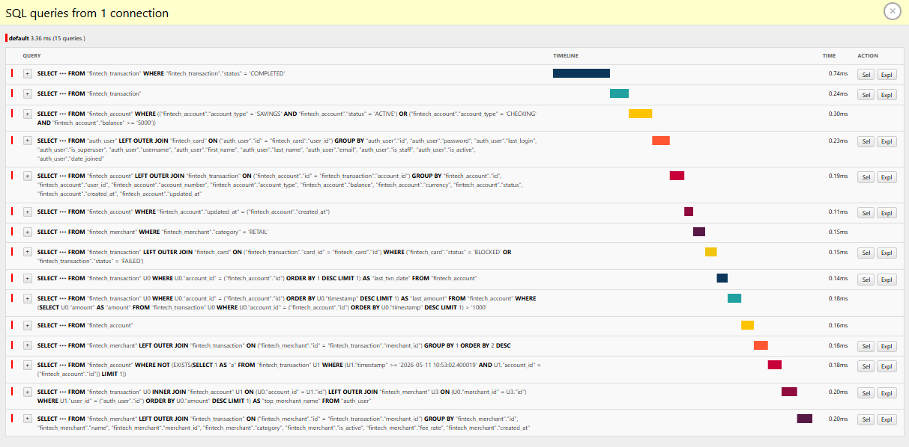

# FIntech Roaster

A Django-based financial technology application demonstrating advanced ORM queries, custom model managers, and database optimization patterns with Django Debug Toolbar integration.

## Features

- **Account Management** — View, filter, and inspect user accounts with related cards and transactions
- **Transaction Tracking** — Browse transactions with pagination and related entity prefetching
- **Merchant Analytics** — Aggregated merchant volume and transaction counts
- **Dashboard** — Real-time metrics: total accounts, active accounts, completed transactions, and total volume
- **15 Advanced ORM Queries** — Demonstrates Q() objects, subqueries, F() expressions, Case/When, aggregations, annotations, and more
- **N+1 Query Demo** — Intentionally slow endpoint to illustrate the N+1 problem and debug toolbar detection
- **Django Debug Toolbar** — Full SQL query inspection with timing, call stack, and raw SQL

## Tech Stack

| Component          | Technology                          |
|--------------------|-------------------------------------|
| Backend            | Django 5.x / 6.x                   |
| Database           | SQLite 3 (dev), PostgreSQL (prod)  |
| Debugging          | Django Debug Toolbar 5.x           |
| Python             | 3.10+                              |

## Project Structure

```
upay_backend/
├── manage.py
├── requirements.txt
├── db.sqlite3
├── djangoInternals/
│   ├── __init__.py
│   ├── settings.py
│   ├── urls.py              # Main URL config (/fintech/, /admin/, /__debug__/)
│   ├── wsgi.py
│   └── asgi.py
├── fintech/
│   ├── __init__.py
│   ├── admin.py
│   ├── apps.py
│   ├── models.py            # Account, Transaction, Merchant, Card, AuditLog
│   ├── views.py             # Class-based + function-based views
│   ├── urls.py              # Fintech app URL routes
│   ├── orm_queries.py       # 15 standalone ORM queries (shell script)
│   ├── tests.py
│   ├── migrations/
│   └── templates/
│       └── fintech/
│           ├── orm_queries_demo.html
│           ├── account_list.html
│           ├── account_detail.html
│           ├── transaction_list.html
│           ├── merchant_list.html
│           ├── dashboard.html
│           └── statement.html
└── venv/
```

## Setup & Installation

### 1. Clone the repository

```bash
git clone https://github.com/Ranger-DRAX/FIntech_Roaster.git
cd FIntech_Roaster
```

### 2. Create a virtual environment

```bash
python -m venv venv
# Windows
venv\Scripts\activate
# macOS / Linux
source venv/bin/activate
```

### 3. Install dependencies

```bash
pip install -r requirements.txt
```

### 4. Run migrations

```bash
python manage.py migrate
```

### 5. Create a superuser (optional)

```bash
python manage.py createsuperuser
```

### 6. Start the development server

```bash
python manage.py runserver
```

The application will be available at `http://127.0.0.1:8000/`.

## API Endpoints

| URL                              | View                        | Description                                      |
|----------------------------------|-----------------------------|--------------------------------------------------|
| `/fintech/`                      | `orm_queries_demo`          | 15 advanced ORM queries with debug toolbar        |
| `/fintech/accounts/`             | `AccountListView`           | Paginated list of all accounts                   |
| `/fintech/accounts/<id>/`        | `AccountDetailView`         | Account detail with cards and transactions       |
| `/fintech/transactions/`         | `TransactionListView`       | Paginated list of all transactions               |
| `/fintech/merchants/`            | `MerchantListView`          | Merchants ranked by transaction volume           |
| `/fintech/dashboard/`            | `DashboardView`             | Aggregated dashboard metrics                     |
| `/fintech/statement-slow/`       | `user_statement_slow`       | N+1 query demo — slow endpoint                   |
| `/admin/`                        | Django Admin                | Admin interface                                  |
| `/__debug__/`                    | Debug Toolbar               | SQL panel, profiling, and inspection             |

## Data Models

### Account
| Field           | Type                      | Description                        |
|-----------------|---------------------------|------------------------------------|
| user            | ForeignKey → User         | Account owner                      |
| account_number  | CharField (unique)        | Unique account identifier          |
| account_type    | CharField (choices)       | SAVINGS, CHECKING, CREDIT          |
| balance         | DecimalField              | Current balance (≥ 0)              |
| currency        | CharField                 | ISO currency code (default: USD)   |
| status          | CharField (choices)       | ACTIVE, FROZEN, CLOSED             |
| created_at      | DateTimeField             | Auto-set on creation               |
| updated_at      | DateTimeField             | Auto-updated on save               |

### Transaction
| Field              | Type                      | Description                        |
|--------------------|---------------------------|------------------------------------|
| transaction_id     | UUIDField (PK)            | Unique transaction UUID            |
| account            | ForeignKey → Account      | Source account                     |
| card               | ForeignKey → Card (null)  | Card used (optional)               |
| merchant           | ForeignKey → Merchant     | Merchant (optional)                |
| amount             | DecimalField              | Transaction amount (> 0)           |
| currency           | CharField                 | ISO currency code                  |
| transaction_type   | CharField (choices)       | DEBIT, CREDIT, REFUND              |
| status             | CharField (choices)       | PENDING, COMPLETED, FAILED, REVERSED |
| description        | TextField                 | Optional description               |
| timestamp          | DateTimeField             | Auto-set on creation               |

### Merchant
| Field        | Type                      | Description                        |
|--------------|---------------------------|------------------------------------|
| name         | CharField                 | Merchant name                      |
| merchant_id  | CharField (unique)        | Unique merchant identifier         |
| category     | CharField (choices)       | RETAIL, FOOD, TRAVEL, ENTERTAINMENT, UTILITIES, OTHER |
| is_active    | BooleanField              | Active status                      |
| fee_rate     | DecimalField              | Fee rate (default: 1.5%)           |

### Card
| Field        | Type                      | Description                        |
|--------------|---------------------------|------------------------------------|
| user         | ForeignKey → User         | Card holder                        |
| account      | ForeignKey → Account      | Linked account                     |
| card_number  | CharField (unique)        | 16-digit card number               |
| card_type    | CharField (choices)       | DEBIT, CREDIT                      |
| status       | CharField (choices)       | ACTIVE, BLOCKED, CANCELLED         |
| expiry_date  | DateField                 | Expiration date                    |
| cvv          | CharField                 | Security code                      |

### AuditLog
| Field        | Type                      | Description                        |
|--------------|---------------------------|------------------------------------|
| user         | ForeignKey → User         | User who performed action          |
| action       | CharField (choices)       | CREATE, UPDATE, DELETE, LOGIN, LOGOUT, TRANSFER |
| model_name   | CharField                 | Affected model name                |
| object_id    | CharField                 | Affected object ID                 |
| description  | TextField                 | Action description                 |
| ip_address   | GenericIPAddressField     | Client IP address                  |
| metadata     | JSONField                 | Additional context data            |

## Custom Managers & QuerySets

The project uses custom managers and querysets for cleaner query patterns:

```python
# Account Manager
Account.objects.active()           # Active accounts only
Account.objects.high_balance()     # Balance ≥ $10,000
Account.objects.savings_accounts() # Savings type accounts

# Transaction Manager
Transaction.objects.completed()    # Completed transactions
Transaction.objects.pending()      # Pending transactions
Transaction.objects.today()        # Today's transactions

# Card Manager
Card.objects.active()              # Active cards
Card.objects.blocked()             # Blocked cards
```

## 15 Advanced ORM Queries

The `/fintech/` endpoint demonstrates 15 advanced Django ORM patterns:

| #  | Technique              | Description                                                       |
|----|------------------------|-------------------------------------------------------------------|
| 1  | **Q() Objects**        | OR conditions — Active Savings OR High Balance Checking            |
| 2  | **Aggregation**        | `Sum` — Total volume of completed transactions                    |
| 3  | **Conditional Count**  | `Count` with `filter=` — Users with active card counts            |
| 4  | **Conditional Sum**    | `Sum` with `filter=` — Total debit spending per account           |
| 5  | **F() Expressions**    | Compare fields — Accounts never updated (`updated_at == created_at`) |
| 6  | **F() Math**           | Arithmetic — Simulate fee rate increase with `F() + Decimal()`    |
| 7  | **Relational Q()**     | Cross-table OR — Blocked card transactions OR failed transactions  |
| 8  | **Subqueries**         | `Subquery` + `OuterRef` — Latest transaction date per account     |
| 9  | **Subquery Filtering** | Annotate then filter — Accounts with last txn > $1000             |
| 10 | **Case/When**          | Conditional annotation — VIP vs Standard tier by balance          |
| 11 | **Multi-Aggregation**  | `Avg`, `Max`, `Min` — Global transaction statistics               |
| 12 | **GroupBy**            | `values().annotate()` — Volume by merchant category               |
| 13 | **Exclude**            | `exclude()` — Accounts with no transactions in last 30 days       |
| 14 | **Nested Subquery**    | Cross-model subquery — Top merchant name per user                 |
| 15 | **Complex Sum**        | `F() * F()` with `DecimalField` — Merchant profit calculation     |

### Running Queries Standalone

```bash
python manage.py shell < fintech/orm_queries.py
```

### Query Report Screenshots

The following screenshots show the Django Debug Toolbar SQL panel after executing all 15 ORM queries on the `/fintech/` endpoint.

**Screenshot 1 — Debug Toolbar SQL Panel Overview:**



**Screenshot 2 — Query Details and Execution Plan:**



## Debug Toolbar

Django Debug Toolbar is pre-configured. Visit any page and the toolbar panel appears on the right side.

### Key Panels

- **SQL** — View all queries, execution time, and raw SQL
- **Profiling** — Request timing breakdown
- **Cache** — Cache hit/miss ratios
- **Headers** — Request and response headers

### Configuration

```python
# djangoInternals/settings.py
INTERNAL_IPS = ["127.0.0.1", "localhost"]

DEBUG_TOOLBAR_CONFIG = {
    "SHOW_TOOLBAR_CALLBACK": lambda request: DEBUG,
}
```

## Database Indexes

Optimized with composite and single-field indexes:

```python
# Account
Index(fields=["user", "status"])
Index(fields=["account_type", "status"])
CheckConstraint(balance__gte=0)

# Transaction
Index(fields=["account", "timestamp"])
Index(fields=["status", "timestamp"])
Index(fields=["transaction_type", "status"])
CheckConstraint(amount__gt=0)

# Merchant
Index(fields=["category", "is_active"])

# Card
Index(fields=["user", "status"])
Index(fields=["account", "status"])

# AuditLog
Index(fields=["user", "action"])
Index(fields=["model_name", "object_id"])
Index(fields=["created_at"])
```

## Running Tests

```bash
python manage.py test fintech
```

## Environment Variables

| Variable                | Default                              | Description                |
|-------------------------|--------------------------------------|----------------------------|
| `DJANGO_SETTINGS_MODULE`| `djangoInternals.settings`           | Django settings module     |
| `SECRET_KEY`            | (insecure dev key)                   | Django secret key          |
| `DEBUG`                 | `True`                               | Debug mode                 |

> **Production:** Set `DEBUG = False`, configure a proper `SECRET_KEY`, and use PostgreSQL.

## License

This project is for educational and demonstration purposes.

## Repository

[https://github.com/Ranger-DRAX/FIntech_Roaster](https://github.com/Ranger-DRAX/FIntech_Roaster)